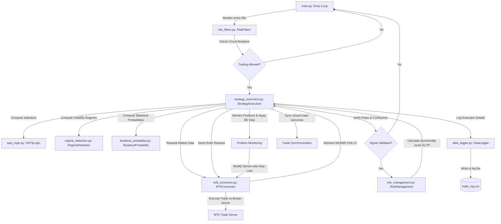

# XAUUSD Scalping Bot: SATS V2 Architecture & Data Reference

This document describes the production architecture of the **XAUUSD Scalping Bot (SATS V2)**. It details the system's codebase, data inputs, indicator mathematics, risk management engine, module implementation status, logging schemas, and configuration parameters.

---

## 1. System Architecture & Component Interactions

The bot is built on a modular Python architecture designed for sub-minute latency execution via the MetaTrader 5 (MT5) terminal.

### Architecture Flow Diagram



### Component File Directory

*   **[main.py](file:///c:/Users/Zarvis/Downloads/xauusd_scalping_bot/xauusd_scalping_bot/src/main.py)**: The central driver. Sets up files, handles connection persistence, and ticks the trading strategy at 60-second intervals.
*   **[strategy_execution.py](file:///c:/Users/Zarvis/Downloads/xauusd_scalping_bot/xauusd_scalping_bot/src/strategy_execution.py)**: Coordinates data retrieval, rule execution, signal gating (TQI, ER, Session, Regime), order execution, position management (+1R breakeven stops, 100-bar timeouts, 50% partial TP1 close), and deal synchronization.
*   **[sats_logic.py](file:///c:/Users/Zarvis/Downloads/xauusd_scalping_bot/xauusd_scalping_bot/src/sats_logic.py)**: Calculates the Self-Aware Trend System (SATS) indicators. Includes Kaufman Efficiency Ratio (ER), Trend Quality Index (TQI), adaptive band widths, asymmetric trailing stops, and early-exit Character Flips.
*   **[regime_detection.py](file:///c:/Users/Zarvis/Downloads/xauusd_scalping_bot/xauusd_scalping_bot/src/regime_detection.py)**: Implements the 3-component rolling z-score volatility and trend classification engine.
*   **[breakout_probability.py](file:///c:/Users/Zarvis/Downloads/xauusd_scalping_bot/xauusd_scalping_bot/src/breakout_probability.py)**: Statistically computes the probability of high/low breakout based on candle color histories.
*   **[risk_management.py](file:///c:/Users/Zarvis/Downloads/xauusd_scalping_bot/xauusd_scalping_bot/src/risk_management.py)**: Handles position sizing based on balance percentage risk (0.5% default) and dynamically calculated Stop Loss and Take Profit levels.
*   **[risk_filters.py](file:///c:/Users/Zarvis/Downloads/xauusd_scalping_bot/xauusd_scalping_bot/src/risk_filters.py)**: Guards the account balance by enforcing daily drawdown caps, max consecutive losses, and pause periods.
*   **[mt5_connector.py](file:///c:/Users/Zarvis/Downloads/xauusd_scalping_bot/xauusd_scalping_bot/src/mt5_connector.py)**: Encapsulates all MT5 API commands (logins, order submission, partial closes, stop modifications, history queries, and auto-launch of `terminal64.exe`).
*   **[data_logger.py](file:///c:/Users/Zarvis/Downloads/xauusd_scalping_bot/xauusd_scalping_bot/src/data_logger.py)**: Manages appending detailed structural and quantitative performance metrics to `data/trade_log.csv`.
*   **[report_generator.py](file:///c:/Users/Zarvis/Downloads/xauusd_scalping_bot/xauusd_scalping_bot/src/report_generator.py)**: Processes historical logs to generate automated statistics and strategic trade diagnosis summaries.
*   **[dashboard.py](file:///c:/Users/Zarvis/Downloads/xauusd_scalping_bot/xauusd_scalping_bot/src/dashboard.py)**: Provides a quick terminal interface wrapper to view diagnostic performance.
*   **[config.py](file:///c:/Users/Zarvis/Downloads/xauusd_scalping_bot/xauusd_scalping_bot/config/config.py)**: Contains all tunable coefficients, threshold limits, server details, and execution parameters.
*   **[phase0_diagnostic.py](file:///c:/Users/Zarvis/Downloads/xauusd_scalping_bot/xauusd_scalping_bot/scratch/phase0_diagnostic.py)**: Diagnostic tool that reads closed trade logs to verify R:R asymmetry, stop loss adjustments, and filter effectiveness.
*   **[test_quant_improvements.py](file:///c:/Users/Zarvis/Downloads/xauusd_scalping_bot/xauusd_scalping_bot/tests/test_quant_improvements.py)**: Verifies correctness of SATS indicator values, bands calculations, Efficiency Ratio, and Trend Quality Index.
*   **[test_session_regime.py](file:///c:/Users/Zarvis/Downloads/xauusd_scalping_bot/xauusd_scalping_bot/tests/test_session_regime.py)**: Asserts correct session time windows (London, NY, Asia, Overlap) and z-score-based regime classification math.
*   **[test_breakout_probability.py](file:///c:/Users/Zarvis/Downloads/xauusd_scalping_bot/xauusd_scalping_bot/tests/test_breakout_probability.py)**: Confirms correct statistical parsing and lookback calculation of candle color histories.
*   **[test_gaps.py](file:///c:/Users/Zarvis/Downloads/xauusd_scalping_bot/xauusd_scalping_bot/tests/test_gaps.py)**: Checks data gap handling and verification.

---

## 2. Data Inputs & Confluence Hierarchy

The bot operates strictly on localized, high-fidelity OHLCV market feeds. It does **not** rely on external APIs, sentiment indicators, or macroeconomic data sources.

### Data Feed Requirements
*   **Asset Class**: XAUUSD Spot Gold CFD
*   **Underlying Bar Data**: M15 (Macro/Filter) and M5 (Execution/Signal)
*   **Lookback Depth**: 200 bars per timeframe
*   **Volume Input**: MT5 Tick Volume (used passively, volume engine deferred)

### Confluence Hierarchy

```
+---------------------------------------------------------------------------------+
|                                 M15 MACRO FILTER                                |
|   - Confluence Direction: Trend must match M5 signal (BUY = Bullish, SELL = Bearish)|
|   - Volatility Guard: M15 ATR Ratio (ATR13/ATR100) >= 1.0                       |
|   - Trend Persistence: M15 Kaufman Efficiency Ratio (ER) >= 0.50                |
|   - Quality Score: M15 Trend Quality Index (TQI) >= 0.60                        |
+---------------------------------------------------------------------------------+
                                         |
                                         v
+---------------------------------------------------------------------------------+
|                                M5 ENTRY TRIGGER                                 |
|   - Signal Generator: Bar closes outside of SATS Kaufman Adaptive Bands         |
|   - Quality Score: M5 Trend Quality Index (TQI) >= 0.60                         |
|   - Breakout Probability: Historical chance of new High/Low >= 60.0%             |
|   - Session & Volatility Regimes: Logged for classification & execution         |
+---------------------------------------------------------------------------------+
```

---

## 3. Core Module Status Table

The development of SATS V2 is structured across four phases. The implementation status of the 13 planned components is summarized below:

| Module # | Component Name | Phase | Code Location | Status | Default Mode / Action |
|---|---|---|---|---|---|
| **Phase 0** | **Pre-Flight Diagnostic** | Phase 0 | `scratch/phase0_diagnostic.py` | **Implemented** | Analyzes trade log, prints exit breakdowns, server-side checks, and SL/TP asymmetry. |
| **Module 1** | **Session Engine** | Phase 1 | `src/strategy_execution.py` (line 16) | **Implemented** | Classifies `ASIA`, `LONDON`, `NEW_YORK`, `OVERLAP`. (Log-only by default). |
| **Module 2** | **Regime Engine** | Phase 1 | `src/regime_detection.py` | **Implemented** | Composite 3-z-score regime classifier (`DEAD`, `EXPLOSIVE`, `TRENDING`, `RANGING`). (Log-only by default). |
| **Module 3** | **Enhanced Logging** | Phase 1 | `src/data_logger.py` | **Implemented** | Captures 27 metrics including session, normalized regime z-scores, slippage, and R:R. |
| **Module 4** | **Location Engine** | Phase 2 | N/A | *Deferred* | Will query pivot structures (PDH, PDL, PWH, PWL) to filter key entry locations. |
| **Module 5** | **Box Theory Engine** | Phase 2 | N/A | *Deferred* | Will define M5 consolidation boxes to prevent trading inside range bounds. |
| **Module 6** | **Volume Engine** | Phase 3 | N/A | *Deferred* | Will integrate tick volume z-scores to ensure liquidity validation. |
| **Module 7** | **Confidence Score** | Phase 1 | `src/strategy_execution.py` (line 93) | **Implemented** | Weighted score combining TQI, ER, volatility ratio, and breakout probability. |
| **Module 8** | **M15 Trend Engine** | Phase 1 | `src/strategy_execution.py` (line 68) | **Implemented** | Core gate enforcing M15 macro trend, TQI >= 0.60, ER >= 0.50, and ATR Ratio >= 1.0. |
| **Module 9** | **M5 Entry Signal** | Phase 1 | `src/sats_logic.py` & `src/strategy_execution.py` | **Implemented** | Primary execution trigger on M5 band flips with TQI >= 0.60 filter. |
| **Module 10** | **Risk Engine V2** | Phase 1 | `src/risk_management.py` & `src/strategy_execution.py` | **Implemented** | Enforces 1.2 ATR stop loss, 1.5R target, server-side execution, daily loss limits, and cooldowns. |
| **Module 11** | **Breakout Probability** | Phase 1 | `src/breakout_probability.py` | **Implemented** | Requires >= 60% historical probability of a new high/low to validate entries. |
| **Module 12** | **Dashboard & Reports** | Phase 1 | `src/report_generator.py` & `src/dashboard.py` | **Implemented** | Outputs performance analytics, including exit breakdown, confidence buckets, and strategic metrics. |
| **Module 13** | **M1 Entry Timing** | Phase 3 | N/A | *Deferred* | Aims to refine execution timing down to the M1 timeframe. |

---

## 4. Mathematical Modeling & Logic

### Kaufman Efficiency Ratio (ER)
Used to measure trend efficiency vs. market noise over a rolling window (20 bars):
$$\text{Change} = |\text{Close}_t - \text{Close}_{t-20}|$$
$$\text{Volatility} = \sum_{i=0}^{19} |\text{Close}_{t-i} - \text{Close}_{t-i-1}|$$
$$\text{ER} = \frac{\text{Change}}{\text{Volatility}}$$

### SATS Kaufman Adaptive Bands
Calculates dynamic boundary lines that expand during erratic ranging phases and compress during strong trend lines:
*   **Regime Multiplier**:
    *   If $\text{ER} > 0.5$: $\text{Regime Multiplier} = 1.0 - (\text{ER} - 0.5) \times 0.5$ (Tighter bands)
    *   If $\text{ER} \le 0.5$: $\text{Regime Multiplier} = 1.0 + (0.5 - \text{ER}) \times 0.5$ (Wider bands)
*   **Volatility Ratio**:
    $$\text{Vol Ratio} = \frac{\text{ATR}_{13}}{\text{Average ATR}_{100}}$$
*   **Band Width**:
    $$\text{Band Width} = (\text{ATR}_{13} \times \text{ER}) \times 2 \times (\text{Regime Multiplier} \times \text{Vol Ratio}) \times (1 + \text{TQI}^{1.5} \times 0.4)$$
*   **Asymmetric Bands Adjustment**:
    If price moves in direction of current trend, bands tighten on the trailing side to capture gains:
    *   *Bullish Trend*: Upper Band is compressed by 5% of asymmetric strength.
    *   *Bearish Trend*: Lower Band is expanded by 5% of asymmetric strength.

### Trend Quality Index (TQI)
Measures the directional health and stability of a trend (0.0 to 1.0):
$$\text{TQI} = (\text{ER} \times 0.35) + (\text{Vol Score} \times 0.20) + (\text{Structure Score} \times 0.25) + (\text{Momentum Persistence} \times 0.20)$$

### Market Regime Detection
Classifies the current market phase into one of four regimes using rolling z-scores over 100 bars:
*   **Inputs**:
    *   $z_{\text{ratio}}$: Rolling z-score of the raw ATR ratio ($\text{ATR}_{13}/\text{ATR}_{100}$).
    *   $z_{\text{er}}$: Rolling z-score of the Kaufman Efficiency Ratio.
    *   $z_{\text{tqi}}$: Rolling z-score of the Trend Quality Index (derived from ER and Volatility Ratio).
*   **Composite Regime Score**:
    $$\text{Composite} = \frac{z_{\text{ratio}} + z_{\text{er}} + z_{\text{tqi}}}{3}$$
*   **Boundaries**:
    *   `DEAD`: $z_{\text{ratio}} < -1.0$ (Very flat, low-volatility environment).
    *   `EXPLOSIVE`: $z_{\text{ratio}} > 1.5$ (Extreme, sudden spike in market volatility).
    *   `TRENDING`: $\text{Composite} \ge 0.1$ (Stable, directional, high-quality movement).
    *   `RANGING`: Default classification if none of the above conditions are met.

---

## 5. V2 Risk Engine & Capital Preservation

The risk engine in SATS V2 addresses the R:R asymmetry found in early testing by moving stop losses to break even, adjusting standard parameters, and enforcing trading cooldowns.

```
                  +----------------------------------------------+
                  |                 Trade Entry                  |
                  |  - Stop Loss: 1.2 ATR                        |
                  |  - Take Profit: 1.5R                         |
                  +----------------------------------------------+
                                         |
                                         | Price reaches +1R (TP1 trigger)
                                         v
                  +----------------------------------------------+
                  |         Breakeven Stop & Partial Close       |
                  |  - SL modified to Entry Price (server-side)  |
                  |  - Close 50% of trade volume                 |
                  +----------------------------------------------+
                                         |
                       ------------------+------------------
                      |                                     |
                      v Price reaches TP (+1.5R)            v Price returns to Entry
         +--------------------------+          +--------------------------+
         |     Take Profit Close    |          |     Breakeven Exit       |
         |  - Remaining volume exit |          |  - Remaining volume exit |
         |  - Target reached        |          |  - Closed at $0 profit   |
         +--------------------------+          +--------------------------+
```

### Risk Controls
1.  **Stop Loss (SL)**: Calculated at `1.2 * ATR13` (capped at 4 ATR or 50 pips).
2.  **Take Profit (TP)**: Set to `1.5 * SL_Distance` (capped at 30 pips).
3.  **Breakeven stop move**: As soon as the price reaches `+1R` (distance equivalent to the initial SL), the bot modifies the order on the MT5 server, shifting the SL to the entry price. This prevents profitable trades from turning into losses.
4.  **Partial Close (TP1)**: At `+1R`, 50% of the trade volume is closed out to secure partial profits.
5.  **Time-Based Exits**: Positions that remain open for 100 bars on the signal timeframe without hitting SL or TP are closed via a market order.
6.  **Daily Max Loss Filter**: If the sum of daily realized and floating losses reaches **2.0%** of the account balance, the bot pauses and blocks further entries.
7.  **Consecutive Loss Circuit Breaker**: Trading is paused if 5 consecutive losses occur.
8.  **Consecutive Loss Cooldowns**:
    *   **3 Consecutive Losses**: Blocks trading for **30 minutes**.
    *   **5 Consecutive Losses**: Blocks trading for **60 minutes**.

---

## 6. CSV Logging Schema (`data/trade_log.csv`)

Every trade executed by the bot is recorded with the following parameters:

| Column Header | Data Type | Source Component | Description |
|---|---|---|---|
| `entry_time` | String | `strategy_execution.py` | UTC timestamp of entry order execution. |
| `exit_time` | String | `strategy_execution.py` | UTC timestamp of exit execution (populated at close). |
| `symbol` | String | `config.py` | Traded instrument (e.g., `XAUUSD`). |
| `direction` | String | `strategy_execution.py` | Direction of the trade: `BUY` or `SELL`. |
| `entry_price` | Float | `mt5_connector.py` | Actual execution price on the broker server. |
| `exit_price` | Float | `mt5_connector.py` | Actual exit price (populated at close). |
| `sl` | Float | `risk_management.py` | Absolute Stop Loss price. |
| `tp` | Float | `risk_management.py` | Absolute Take Profit price. |
| `lot` | Float | `risk_management.py` | Traded lot size. |
| `m15_trend` | Integer | `sats_logic.py` | Macro trend filter state: `1` (Bullish), `-1` (Bearish). |
| `profit` | Float | `mt5_connector.py` | Net trade profit/loss in currency (includes commissions/swap). |
| `status` | String | `strategy_execution.py` | Execution state: `OPEN` or `CLOSED`. |
| `ticket` | Integer | `mt5_connector.py` | Unique MT5 position identification ticket. |
| `session` | String | `strategy_execution.py` | Session classification: `ASIA`, `LONDON`, `NEW_YORK`, `OVERLAP`. |
| `regime` | String | `regime_detection.py` | Volatility regime: `TRENDING`, `RANGING`, `DEAD`, `EXPLOSIVE`. |
| `regime_norm_vol` | Float | `regime_detection.py` | Normalized ATR ratio z-score value ($z_{\text{ratio}}$). |
| `regime_norm_trend` | Float | `regime_detection.py` | Normalized ER z-score value ($z_{\text{er}}$). |
| `tqi` | Float | `sats_logic.py` | Raw Trend Quality Index score on the execution timeframe. |
| `atr_ratio` | Float | `regime_detection.py` | Raw ATR ratio ($\text{ATR}_{13}/\text{ATR}_{100}$). |
| `volume_score` | Variant | N/A | *Deferred* (stored as `None`). |
| `confidence_score` | Float | `strategy_execution.py` | Weighted composite confidence percentage (0 to 100). |
| `box_size` | Variant | N/A | *Deferred* (stored as `None`). |
| `exit_type` | String | `strategy_execution.py` | Detailed exit category: `SL`, `TP`, `TIMEOUT`. |
| `rr_achieved` | Float | `strategy_execution.py` | Multiplier of risk distance captured. |
| `intended_entry_price`| Float | `strategy_execution.py` | Target price computed at signal time. |
| `realized_slippage` | Float | `strategy_execution.py` | Difference between `entry_price` and `intended_entry_price`. |
| `breakout_prob` | Float | `breakout_probability.py` | Statistical breakout check value. |

---

## 7. Key Configuration Parameters

The parameters listed below are defined in `config/config.py` and govern the SATS V2 system behavior:

```python
# Confluence Settings
MACRO_TREND_TIMEFRAME = "M15"  # Filters trend direction
CONF_TREND_TIMEFRAME = "M15"   # Intermediate trend filter
ENTRY_TIMEFRAME = "M5"         # Entry timeframe (switched to M5 for V2)

# Dynamic Boundaries & SATS (sats_logic.py)
ATR_LENGTH = 13
EFFICIENCY_WINDOW = 20
ADAPTATION_STRENGTH = 0.5
ATR_BASELINE = 100
QUALITY_INFLUENCE = 0.4
QUALITY_CURVE_POWER = 1.5
ASYMMETRIC_BANDS_ENABLED = True
ASYMMETRIC_BANDS_STRENGTH = 0.5
CHARACTER_FLIP_ENABLED = True
CHARACTER_FLIP_MIN_AGE = 5

# Risk Settings (risk_management.py)
RISK_PER_TRADE_PERCENT = 0.005  # 0.5% balance risk per trade
SL_ATR_MULTIPLIER = 1.2        # Dynamic Stop Loss ATR multiplier
MAX_SL_ATR_MULTIPLIER = 4      # Stop Loss ceiling multiplier
MAX_SL_PIPS = 50               # Stop Loss ceiling in pips ($5.00 distance)
TP_MULTIPLIER = 1.5            # Target reward-to-risk ratio (1.5R)
TP1_MULTIPLIER = 0.5           # Initial +1R trigger target (measured against entry-to-SL)
TP1_PARTIAL_CLOSE_PERCENT = 0.5 # 50% partial position close
MAX_TP_PIPS = 30               # Take Profit ceiling in pips ($3.00 distance)
TRADE_TIMEOUT_BARS = 100       # Position timeout limit

# Risk Filters & Cooldowns (risk_filters.py)
DAILY_MAX_LOSS_PERCENT = 0.02  # 2% daily loss limit
MAX_CONSECUTIVE_LOSSES = 5     # Consecutive loss limit
CONSECUTIVE_LOSS_COOLDOWN_3 = 30 # 30-minute pause after 3 losses
CONSECUTIVE_LOSS_COOLDOWN_5 = 60 # 60-minute pause after 5 losses

# Volatility Regime Scoring (regime_detection.py)
REGIME_LOOKBACK_BARS = 100
REGIME_VOL_DEAD_THRESHOLD = -1.0     # Volatility z-score below this is classified as DEAD
REGIME_VOL_EXPLOSIVE_THRESHOLD = 1.5 # Volatility z-score above this is classified as EXPLOSIVE
REGIME_TREND_MIN_THRESHOLD = 0.1     # Composite score above this is classified as TRENDING
ALLOWED_REGIMES = ['TRENDING', 'RANGING', 'DEAD', 'EXPLOSIVE'] # Phase 1 default (log-only)

# Breakout Probability Indicator
BREAKOUT_PROBABILITY_ENABLED = True
BREAKOUT_MIN_PROBABILITY_THRESHOLD = 0.60 # Minimum probability threshold to confirm bias (60%)

# Session & Confidence scoring
SESSION_TEST_FILTER_ENABLED = False
DISABLED_SESSIONS = []
MIN_CONFIDENCE_SCORE = 55.0 # Confidence threshold (0-100)

# Cooldowns
CONSECUTIVE_LOSS_COOLDOWN_3 = 30  # Minutes to pause after 3 losses
CONSECUTIVE_LOSS_COOLDOWN_5 = 60  # Minutes to pause after 5 losses
```

---

## 8. Development & Diagnostic Utilities

### Pre-Flight Log Diagnostic Script
Before starting live trading sessions, run the diagnostic utility to analyze historical risk performance and trace SL/TP executions:
```powershell
python scratch/phase0_diagnostic.py
```
This utility reads `data/trade_log.csv` and highlights:
*   Realized SL/TP distribution and ratios.
*   Risk-to-reward asymmetry.
*   Exit classification breakdown (`SL`, `TP`, `TIMEOUT`).
*   Potential server-side execution slippage.

### Starting the SATS V2 Scalping Bot
To launch the trading logic loop:
```powershell
python -m src.main
```

### Viewing the Performance Dashboard
To check performance metrics and generated charts:
```powershell
python -m src.dashboard
```
